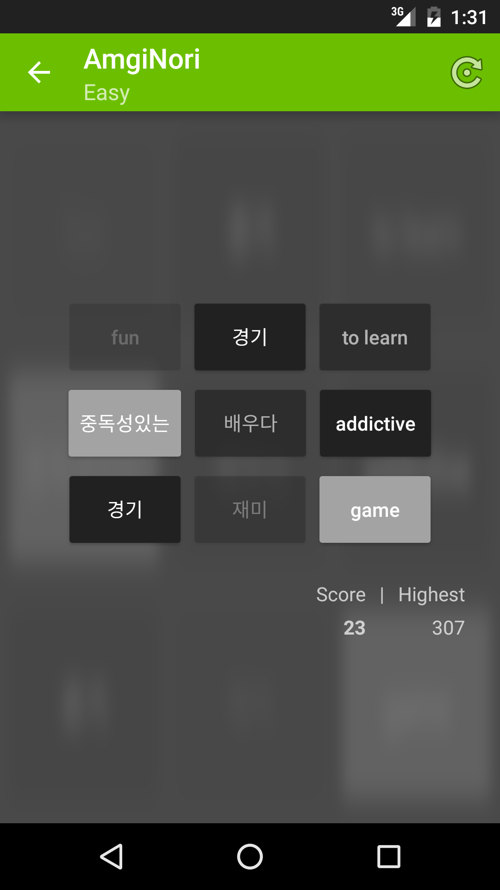
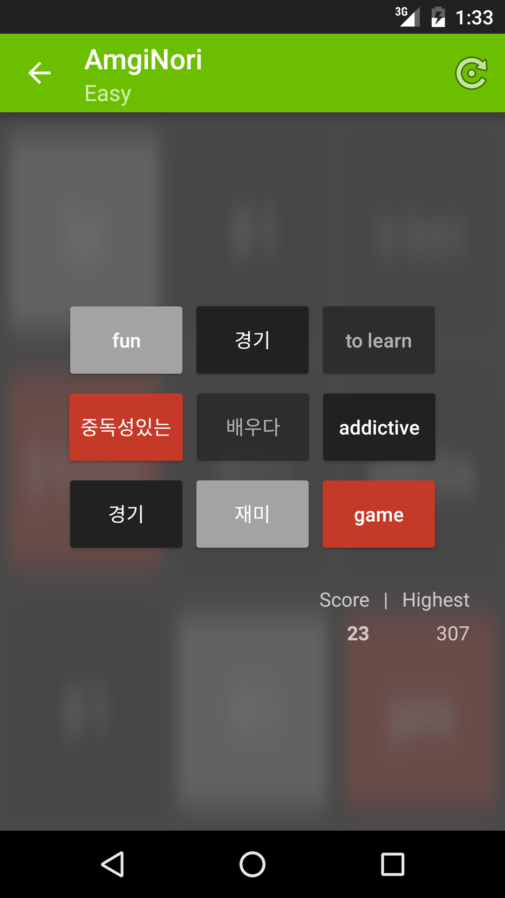

## AmgiNori
AmgiNori is perfect to revise flashcards in a fun way. Simply start by adding your flashcards directly through AmgiNori or by importing an existing [Anki](http://ankisrs.net) card collection.

  

## Install
Install directly from [here on github](https://github.com/mattstraehl/AmgiNori/releases/latest) or stay up-to-date automatically by installing via Google Play:

[![Get it on Google Play][2]][1]

  [1]: https://play.google.com/store/apps/details?id=com.matthias.android.amginori
  [2]: https://developer.android.com/images/brand/en_generic_rgb_wo_60.png

